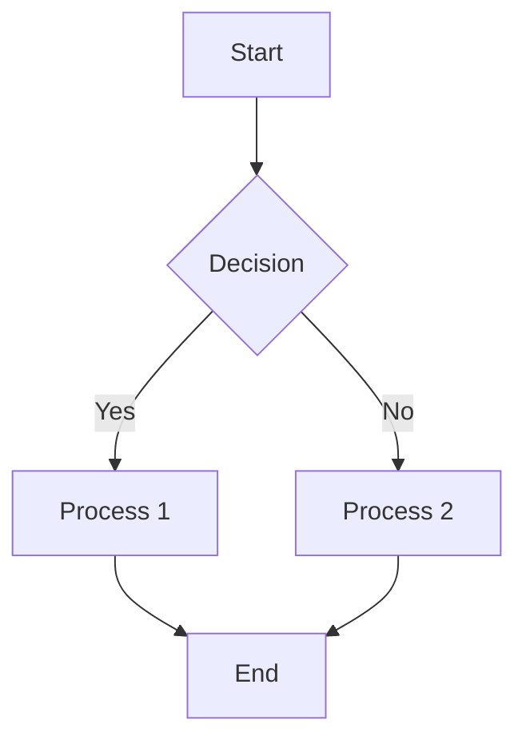
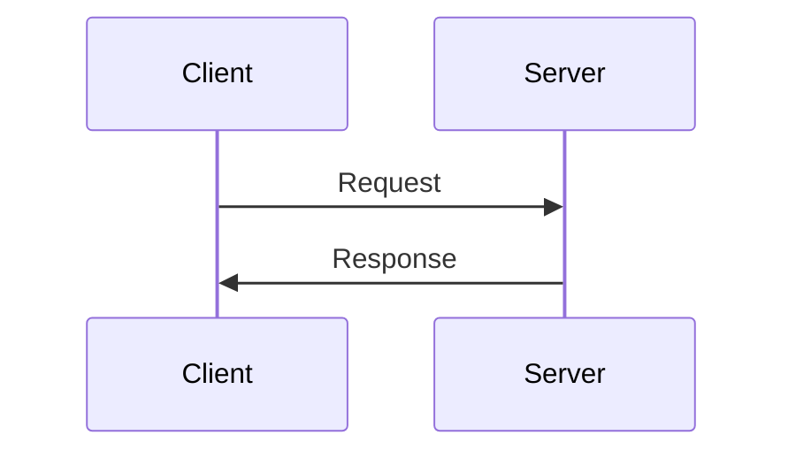
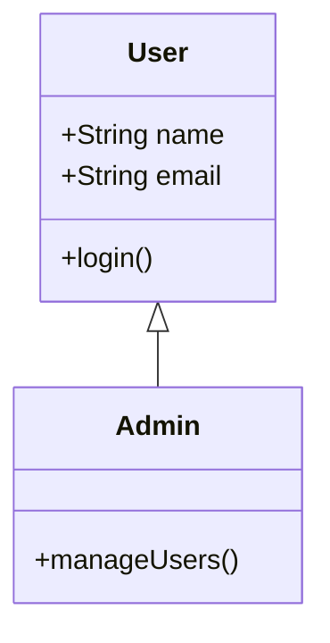
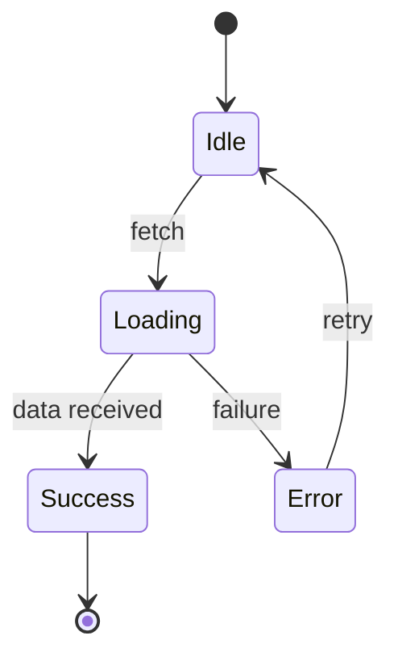
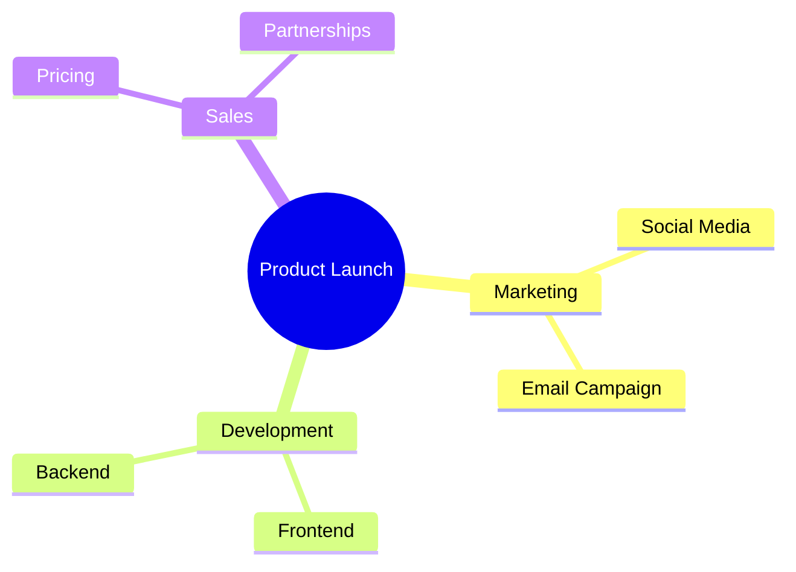

# 🎨 AI-Powered Diagram Generator

Transform natural language descriptions into professional diagrams using OpenAI and Mermaid.js. Perfect for system design, workflows, mind maps, and collaborative documentation.

## ✨ Features

### AI-Powered Generation
- 🤖 **Natural Language Input** - Describe your diagram in plain English
- 🎯 **12 Diagram Types** - Flowcharts, sequence, class, state, ER, Gantt, pie charts, mind maps & more
- ⚡ **Instant Generation** - Get professional diagrams in seconds
- 🔄 **Version Control** - Track changes and iterate on designs
- 💡 **Smart Suggestions** - AI refines and optimizes your diagram structure

### Collaboration & Sharing
- 👥 **Role-Based Access** - Owner, Editor, Viewer permissions
- 💬 **Contextual Comments** - Attach notes to specific diagram elements
- 🔗 **Sticky Notes Integration** - Link diagrams to collaborative boards
- 🌐 **Public/Private Sharing** - Control diagram visibility
- 📧 **Member Invitations** - Invite team members via email

### Export & Integration
- �� **Multiple Formats** - Export as PNG, SVG, PDF, Mermaid, JSON
- 📊 **Embed Anywhere** - Use generated SVG in presentations
- 🎨 **Customizable** - Edit Mermaid code directly
- 📱 **Responsive** - Works on desktop, tablet, and mobile

## 🎭 Supported Diagram Types

| Type | Description | Use Cases |
|------|-------------|-----------|
| **Flowchart** | Process flows with decision points | Business processes, algorithms |
| **Sequence** | Time-ordered interactions | API calls, user flows |
| **Class** | Object-oriented relationships | Software architecture |
| **State** | State machines and transitions | UI states, workflows |
| **ER Diagram** | Entity relationships | Database design |
| **Gantt** | Project timelines | Project management |
| **Pie Chart** | Data distribution | Statistics, budgets |
| **User Journey** | User experience flows | UX design |
| **Git Graph** | Version control branches | Development workflows |
| **Mind Map** | Hierarchical ideas | Brainstorming |
| **Timeline** | Chronological events | Roadmaps, history |
| **Quadrant** | 2x2 matrix analysis | Decision making |

## 🏗️ Architecture

### Technology Stack
- **AI Engine**: OpenAI GPT-4 for diagram generation
- **Rendering**: Mermaid.js for visual output
- **Backend**: Node.js + Express + Prisma
- **Frontend**: React + Next.js + TailwindCSS
- **Database**: PostgreSQL

### Data Flow

```
User Prompt → OpenAI API → Mermaid Code → Renderer → SVG/Display
                   ↓
            Save to Database
                   ↓
         Version Control + Comments
```

## 🚀 Quick Start

### 1. Install Dependencies

```bash
cd backend
npm install openai
```

### 2. Environment Configuration

Add to `backend/.env`:

```env
# OpenAI Configuration
OPENAI_API_KEY=sk-proj-your-openai-api-key
OPENAI_MODEL=gpt-4-turbo-preview
OPENAI_MAX_TOKENS=2000
```

### 3. Database Migration

```bash
cd backend
npx prisma migrate dev --name add-ai-diagrams
npx prisma generate
```

### 4. Add Backend Routes

In `backend/src/index.ts`:

```typescript
import aiDiagramsRouter from './routes/ai-diagrams';
app.use('/api/ai-diagrams', aiDiagramsRouter);
```

### 5. Install Frontend Dependencies

```bash
cd frontend
npm install mermaid @types/mermaid
```

### 6. Start Development Servers

```bash
# Terminal 1 - Backend
cd backend
npm run dev

# Terminal 2 - Frontend  
cd frontend
npm run dev
```

### 7. Access the Application

- Diagram Gallery: `http://localhost:3000/diagrams`
- Create New: `http://localhost:3000/diagrams/new`
- View Diagram: `http://localhost:3000/diagrams/[id]`

## 📖 Usage Guide

### Creating a Diagram

**Method 1: Text Prompt**
1. Navigate to `/diagrams/new`
2. Enter a description like:
   ```
   Create a flowchart for a user login process with authentication,
   2FA verification, and error handling
   ```
3. Select diagram type (or let AI decide)
4. Click "Generate Diagram"
5. AI produces the Mermaid code and renders it

**Method 2: Quick Templates**
1. Choose from predefined templates
2. Customize the prompt
3. Generate instantly

### Example Prompts

**Flowchart:**
```
E-commerce checkout process with payment gateway integration,
inventory check, and order confirmation email
```

**Sequence Diagram:**
```
User authentication flow showing interactions between frontend,
backend API, database, and email service
```

**Mind Map:**
```
Product launch strategy covering marketing channels,
timeline, budget allocation, and success metrics
```

**Gantt Chart:**
```
6-month software development project with design, development,
testing, and deployment phases
```

**ER Diagram:**
```
Database schema for a blog platform with users, posts,
comments, and categories
```

### Editing Generated Diagrams

1. **AI Refinement**: Provide feedback and regenerate
   ```
   Make the flowchart more detailed with error handling
   ```

2. **Direct Code Edit**: Modify Mermaid syntax manually
   ```mermaid
   graph TD
       A[Start] --> B{Decision}
       B -->|Yes| C[Action 1]
       B -->|No| D[Action 2]
   ```

3. **Version Control**: Save iterations as new versions

### Collaborating

**Invite Members:**
1. Open a diagram
2. Click "Share" → "Invite Members"
3. Enter email addresses
4. Assign roles (Owner/Editor/Viewer)

**Add Comments:**
1. Click on diagram area
2. Add contextual comment
3. Tag team members

**Link to Sticky Notes:**
1. Attach diagram to a board
2. Reference in notes for integrated planning

## 📊 API Documentation

### Endpoints

#### Diagrams

**Create Diagram (AI Generation)**
```http
POST /api/ai-diagrams/generate
Authorization: Bearer <token>
Content-Type: application/json

{
  "prompt": "Create a sequence diagram for user authentication",
  "diagramType": "SEQUENCE",
  "title": "Auth Flow Diagram",
  "description": "Shows user login process",
  "isPublic": false,
  "boardId": "optional-board-id"
}
```

**Response:**
```json
{
  "success": true,
  "diagram": {
    "id": "clxxx123",
    "title": "Auth Flow Diagram",
    "mermaidCode": "sequenceDiagram\n    participant U as User\n    ...",
    "svgContent": "<svg>...</svg>",
    "diagramType": "SEQUENCE"
  }
}
```

**Get All Diagrams**
```http
GET /api/ai-diagrams
Authorization: Bearer <token>
```

**Get Diagram by ID**
```http
GET /api/ai-diagrams/:id
Authorization: Bearer <token>
```

**Update Diagram**
```http
PUT /api/ai-diagrams/:id
Authorization: Bearer <token>
Content-Type: application/json

{
  "title": "Updated Title",
  "mermaidCode": "graph TD\n    A --> B",
  "isPublic": true
}
```

**Delete Diagram**
```http
DELETE /api/ai-diagrams/:id
Authorization: Bearer <token>
```

**Regenerate with AI**
```http
POST /api/ai-diagrams/:id/regenerate
Authorization: Bearer <token>
Content-Type: application/json

{
  "prompt": "Make this flowchart more detailed with error handling"
}
```

#### Members

**Add Member**
```http
POST /api/ai-diagrams/:id/members
Authorization: Bearer <token>
Content-Type: application/json

{
  "email": "user@example.com",
  "role": "EDITOR"
}
```

**Remove Member**
```http
DELETE /api/ai-diagrams/:id/members/:memberId
Authorization: Bearer <token>
```

**Update Member Role**
```http
PUT /api/ai-diagrams/:id/members/:memberId
Authorization: Bearer <token>
Content-Type: application/json

{
  "role": "VIEWER"
}
```

#### Comments

**Add Comment**
```http
POST /api/ai-diagrams/:id/comments
Authorization: Bearer <token>
Content-Type: application/json

{
  "content": "This flow needs error handling",
  "positionX": 150,
  "positionY": 200
}
```

**Get Comments**
```http
GET /api/ai-diagrams/:id/comments
Authorization: Bearer <token>
```

**Delete Comment**
```http
DELETE /api/ai-diagrams/comments/:commentId
Authorization: Bearer <token>
```

#### Export

**Export Diagram**
```http
POST /api/ai-diagrams/:id/export
Authorization: Bearer <token>
Content-Type: application/json

{
  "format": "PNG",
  "width": 1920,
  "height": 1080
}
```

**Supported formats:** PNG, SVG, PDF, MERMAID, JSON

## 🎨 Mermaid.js Syntax Guide

### Flowchart


### Sequence Diagram


### Class Diagram


### State Diagram


### Mind Map


## 🔐 Permissions & Security

### Role Matrix

| Action | Owner | Editor | Viewer |
|--------|-------|--------|--------|
| View Diagram | ✅ | ✅ | ✅ |
| Edit Diagram | ✅ | ✅ | ❌ |
| Delete Diagram | ✅ | ❌ | ❌ |
| Add Members | ✅ | ❌ | ❌ |
| Remove Members | ✅ | ❌ | ❌ |
| Change Roles | ✅ | ❌ | ❌ |
| Export Diagram | ✅ | ✅ | ✅ |
| Add Comments | ✅ | ✅ | ✅ |
| Delete Own Comments | ✅ | ✅ | ✅ |
| Delete Others' Comments | ✅ | ❌ | ❌ |

### Security Features
- 🔐 **JWT Authentication** - Secure API access
- 🛡️ **Rate Limiting** - Prevent abuse (10 requests/min for generation)
- ✅ **Input Validation** - Sanitize user prompts
- 🔒 **Permission Checks** - Role-based access control
- 📝 **Audit Logging** - Track all diagram operations

## 🧪 Testing

### Manual Testing Checklist

- [ ] Generate flowchart from prompt
- [ ] Generate sequence diagram
- [ ] Generate mind map
- [ ] Edit Mermaid code manually
- [ ] Save and reload diagram
- [ ] Create new version from existing
- [ ] Invite member with email
- [ ] Test Owner/Editor/Viewer permissions
- [ ] Add comment on diagram
- [ ] Export as PNG
- [ ] Export as SVG
- [ ] Export as PDF
- [ ] Link diagram to sticky notes board
- [ ] Make diagram public
- [ ] Share public link
- [ ] Delete diagram

### AI Quality Tests

Test these prompts to verify AI generation:

```bash
# Test 1: Simple flowchart
"User registration process with email verification"

# Test 2: Complex sequence
"Microservices architecture with API gateway, auth service, and database"

# Test 3: Mind map
"Company strategic planning including vision, goals, initiatives, and KPIs"

# Test 4: Gantt chart
"Website redesign project with 4 phases over 3 months"

# Test 5: ER diagram
"Social media platform database with users, posts, likes, and followers"
```

## 🔄 OpenAI Integration

### Prompt Engineering

The system uses a carefully crafted prompt to ensure high-quality diagrams:

```typescript
const systemPrompt = `You are an expert diagram generator.
Generate Mermaid.js code for ${diagramType} diagrams.

Rules:
1. Output ONLY valid Mermaid.js syntax
2. Use clear, concise labels
3. Follow best practices for ${diagramType} diagrams
4. Include proper formatting and indentation
5. Add comments for complex sections
6. Ensure the diagram is complete and renders correctly

User request: ${userPrompt}

Generate the Mermaid code:`;
```

### Token Management
- **Model**: GPT-4 Turbo (128k context)
- **Max Tokens**: 2000 (configurable)
- **Temperature**: 0.7 (balanced creativity)
- **Cost Optimization**: Cache common patterns

### Error Handling
```typescript
try {
  const diagram = await generateDiagram(prompt, type);
} catch (error) {
  if (error.code === 'insufficient_quota') {
    return res.status(402).json({ error: 'OpenAI quota exceeded' });
  }
  if (error.code === 'invalid_request_error') {
    return res.status(400).json({ error: 'Invalid prompt' });
  }
  // Fallback to template
  return generateFromTemplate(type);
}
```

## 📈 Performance Optimization

### Caching Strategy
1. **SVG Caching**: Store rendered SVG in database
2. **Common Patterns**: Cache frequently used diagram types
3. **Redis Layer**: Cache API responses (5 min TTL)

### Rendering Optimization
```typescript
// Lazy load Mermaid.js only when needed
import('mermaid').then(({ default: mermaid }) => {
  mermaid.initialize({ 
    startOnLoad: false,
    theme: 'default',
    securityLevel: 'strict'
  });
});
```

### Rate Limiting
```typescript
// Apply stricter limits to AI generation
const aiRateLimit = rateLimit({
  windowMs: 60 * 1000, // 1 minute
  max: 10, // 10 requests per minute
  message: 'Too many diagram generation requests'
});

router.post('/generate', authenticateToken, aiRateLimit, generateHandler);
```

## 🚀 Future Enhancements

### Phase 2
- [ ] Real-time collaborative editing (operational transforms)
- [ ] AI-powered diagram suggestions
- [ ] Custom color themes and styling
- [ ] Diagram templates library
- [ ] Voice-to-diagram input
- [ ] Mobile app (React Native)

### Phase 3
- [ ] Animation support for diagrams
- [ ] Interactive diagrams (clickable elements)
- [ ] Integration with Figma/Lucidchart
- [ ] AI-powered diagram optimization
- [ ] Multi-language support
- [ ] Version comparison (diff view)
- [ ] Presentation mode with speaker notes

### Phase 4
- [ ] Diagram-to-code generation
- [ ] Code-to-diagram reverse engineering
- [ ] AI training on company-specific patterns
- [ ] Enterprise SSO integration
- [ ] Advanced analytics dashboard
- [ ] Compliance exports (ISO, GDPR)

## 🐛 Troubleshooting

### Common Issues

**Diagram Not Rendering**
```bash
# Check Mermaid syntax
npx mermaid-cli validate diagram.mmd

# Validate in browser console
mermaid.parse(mermaidCode);
```

**OpenAI API Errors**
- Verify API key in .env
- Check quota at platform.openai.com
- Ensure model availability (gpt-4-turbo-preview)

**Permission Denied**
- Verify JWT token
- Check user role for diagram
- Confirm diagram membership

**Export Failed**
- Check disk space for PDF generation
- Verify ImageMagick installation (for PNG)
- Try smaller diagram size

### Debug Mode

Enable detailed logging:

```env
DEBUG=ai-diagrams:*
LOG_LEVEL=debug
```

## 📚 Resources

- [Mermaid.js Documentation](https://mermaid.js.org/)
- [OpenAI API Reference](https://platform.openai.com/docs)
- [Mermaid Live Editor](https://mermaid.live/)
- [Diagram Examples](https://mermaid.js.org/examples.html)

## 📄 License

Part of the Advancia Pay Ledger project.

---

**Version:** 1.0.0  
**Last Updated:** December 25, 2025  
**Status:** Production Ready ✅  
**Powered by:** OpenAI GPT-4 + Mermaid.js

## 🎯 Next Steps

1. ✅ Copy schema from `AI_DIAGRAM_SCHEMA.prisma` to main `schema.prisma`
2. ✅ Run `npx prisma migrate dev --name add-ai-diagrams`
3. ✅ Add OpenAI API key to `.env`
4. ✅ Implement backend routes (see implementation files)
5. ✅ Create frontend components
6. ✅ Test with sample prompts
7. ✅ Deploy to production

**Ready to transform ideas into visual diagrams! 🎨**
