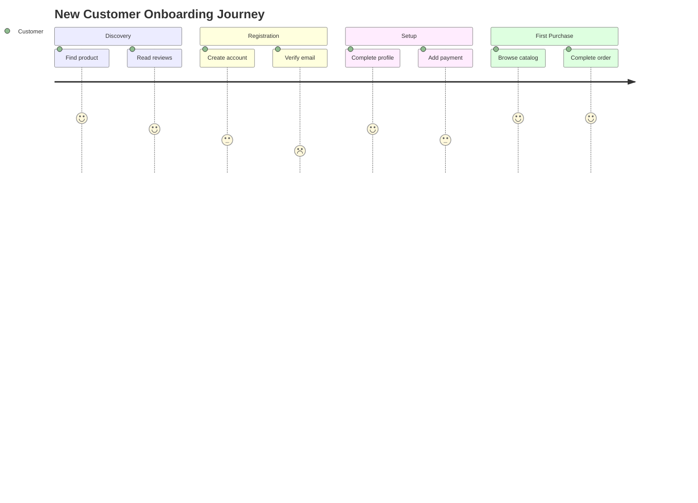
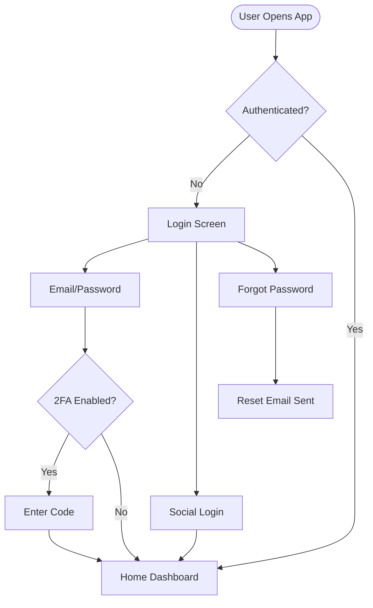
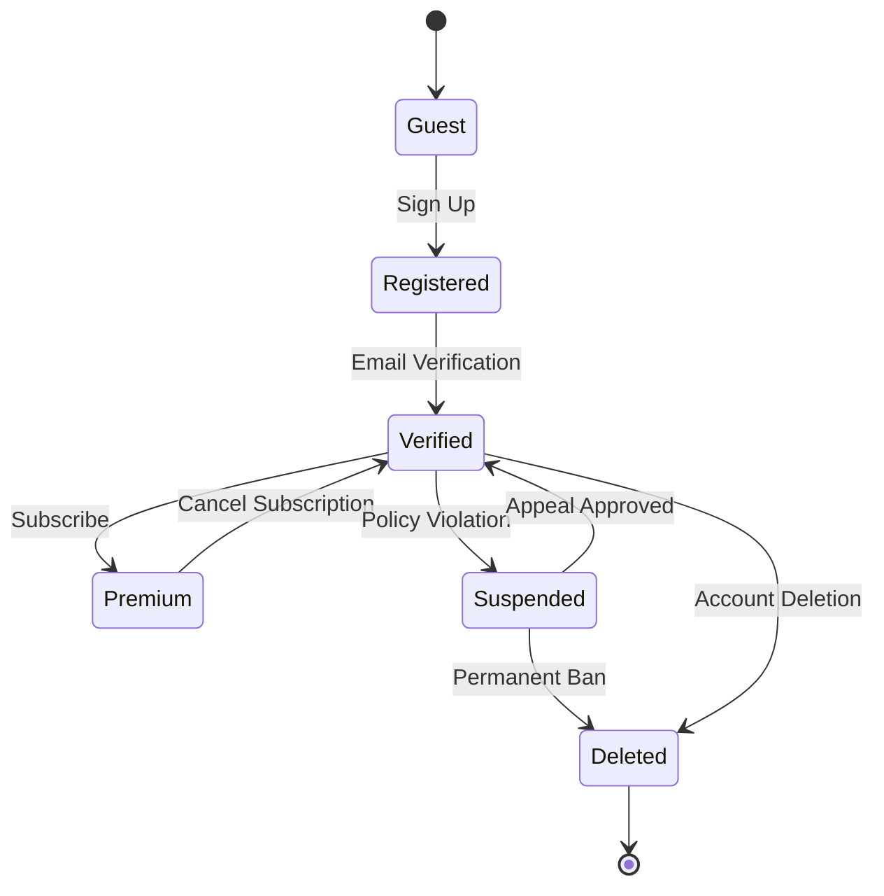

# UX Flows - AI Diagram Generation Guide

## 🎨 Creating UX Flows with AI Diagrams

Our AI diagram system supports multiple diagram types perfect for UX workflows:

### 1. User Journey Maps
**Type:** `USER_JOURNEY`

**Example Prompts:**
```
"Create a user journey for new customer onboarding with registration, email verification, profile setup, and first purchase. Include satisfaction scores for each step."

"Map the support ticket submission journey with satisfaction levels from frustrated to delighted across discovery, submission, tracking, and resolution phases."

"Design a shopping experience journey from product discovery through checkout with emotional states at each touchpoint."
```

**Sample Output:**


### 2. User Flow Diagrams
**Type:** `FLOWCHART`

**Example Prompts:**
```
"Create a user authentication flow with email/password login, social login, 2FA, forgot password, and account locked states."

"Design a checkout flow with cart review, shipping selection, payment methods, order confirmation, and error handling for payment failure."

"Map the content creation workflow with draft, review, revision, approval, and publish states including user roles."
```

**Sample Output:**


### 3. State Diagrams
**Type:** `STATE`

**Example Prompts:**
```
"Create state diagram for order status: pending, processing, shipped, delivered, cancelled, refunded with all transitions."

"Design user account states: guest, registered, verified, premium, suspended, deleted with transition conditions."

"Map task workflow states from created through completed with assigned, in-progress, blocked, and review states."
```

**Sample Output:**


### 4. Sequence Diagrams
**Type:** `SEQUENCE`

**Example Prompts:**
```
"Create interaction sequence for user login showing frontend, API gateway, auth service, database, and email service with success and failure paths."

"Design payment processing sequence with user, checkout service, payment gateway, fraud detection, and order service."

"Map real-time chat sequence between users with WebSocket server, message queue, and notification service."
```

## 🚀 Quick Start - Generate Your First UX Flow

### Step 1: Start the Backend
```bash
cd backend
npm run dev
```

### Step 2: Test API (Get a JWT token first)
```bash
# Login to get token
curl -X POST http://localhost:4000/api/auth/login \
  -H "Content-Type: application/json" \
  -d '{
    "email": "test@example.com",
    "password": "password123"
  }'

# Generate UX Flow
curl -X POST http://localhost:4000/api/ai-diagrams/generate \
  -H "Authorization: Bearer YOUR_JWT_TOKEN" \
  -H "Content-Type: application/json" \
  -d '{
    "prompt": "Create a user journey for mobile app onboarding with account creation, permissions setup, tutorial, and first action. Show satisfaction scores.",
    "title": "Mobile Onboarding Journey",
    "diagramType": "USER_JOURNEY"
  }'
```

### Step 3: Use in Frontend
```typescript
import DiagramGenerator from '@/components/diagrams/DiagramGenerator';
import DiagramViewer from '@/components/diagrams/DiagramViewer';

export default function UXFlowsPage() {
  const [diagram, setDiagram] = useState(null);

  const handleGenerate = async ({ prompt, type, title }) => {
    const res = await fetch('/api/ai-diagrams/generate', {
      method: 'POST',
      headers: {
        'Content-Type': 'application/json',
        Authorization: `Bearer ${localStorage.getItem('token')}`,
      },
      body: JSON.stringify({ prompt, diagramType: type, title }),
    });
    
    const data = await res.json();
    setDiagram(data.diagram);
  };

  return (
    <div className="container mx-auto py-8">
      <h1 className="text-4xl font-bold mb-8">UX Flow Generator</h1>
      
      <DiagramGenerator onGenerate={handleGenerate} />
      
      {diagram && (
        <div className="mt-8">
          <DiagramViewer code={diagram.mermaidCode} theme="default" />
          <div className="mt-4 p-4 bg-gray-50 rounded">
            <h3 className="font-semibold">Generated Prompt:</h3>
            <p className="text-sm text-gray-600">{diagram.prompt}</p>
          </div>
        </div>
      )}
    </div>
  );
}
```

## 📝 UX Flow Best Practices

### For User Journeys:
- Include emotional states (satisfaction scores 1-5)
- Break into logical sections (Discovery, Action, Resolution)
- Show multiple actors if relevant (Customer, Support, System)

### For Flowcharts:
- Use clear decision points with yes/no branches
- Include error states and recovery paths
- Keep depth manageable (3-5 levels max)

### For State Diagrams:
- Show all possible states
- Include transition conditions
- Mark terminal states clearly

### Effective Prompts:
✅ "Create a checkout flow with payment validation, inventory check, and confirmation email"
✅ "Design user journey for support ticket with 5 sections showing satisfaction levels"
❌ "Make a diagram"
❌ "User flow"

## 🎯 Common UX Flow Patterns

### 1. Onboarding Flow
```
Prompt: "Multi-step onboarding with welcome, account setup, permissions, tutorial, and success celebration. Include skip options and progress tracking."
Type: FLOWCHART
```

### 2. E-commerce Purchase Journey
```
Prompt: "Complete shopping experience from product discovery through post-purchase with browse, search, compare, add to cart, checkout, payment, confirmation, and tracking."
Type: USER_JOURNEY
```

### 3. Form Submission Flow
```
Prompt: "Form workflow with field validation, draft saving, submission, backend processing, success/error feedback, and email confirmation."
Type: SEQUENCE
```

### 4. Account Management States
```
Prompt: "User account lifecycle from registration through deletion including verification, active, trial, premium, suspended, and dormant states."
Type: STATE
```

## 🔧 Advanced Features

### Regenerate with Refinements
```bash
curl -X POST http://localhost:4000/api/ai-diagrams/:id/regenerate \
  -H "Authorization: Bearer TOKEN" \
  -d '{
    "prompt": "Add error handling for network timeout and add a retry button"
  }'
```

### Add Comments
```bash
curl -X POST http://localhost:4000/api/ai-diagrams/:id/comments \
  -H "Authorization: Bearer TOKEN" \
  -d '{
    "content": "Should we add a loading state here?",
    "positionX": 150,
    "positionY": 200
  }'
```

## 📊 Diagram Type Reference

| Type | Best For | Complexity |
|------|----------|------------|
| USER_JOURNEY | Emotional mapping, satisfaction tracking | Medium |
| FLOWCHART | Decision trees, process flows | Low-High |
| SEQUENCE | System interactions, API calls | Medium |
| STATE | Status transitions, lifecycle | Medium |
| MINDMAP | Information architecture | Low |
| GANTT | Timeline planning | Medium |

---

**Next Steps:**
1. Generate your first UX flow
2. Refine with AI regeneration
3. Add team comments
4. Export as PNG/SVG for presentations

**Documentation:** See AI_DIAGRAM_README.md for full API reference
